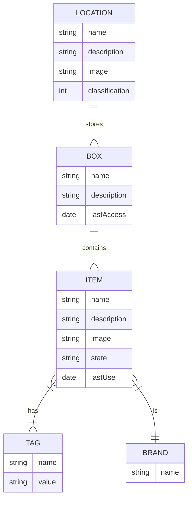

## Data Structure

```mermaid
erDiagram
    LOCATION {
        string name
        string description
        string image
        int classification
    }

    
    BOX {
        string name
        string description
        date lastAccess
    }


    ITEM {
        string name
        string description
        string image
        string state
        date lastUse

    }

    TAG {
        string name
        string value
    }

    BRAND {
        string name
    }


    LOCATION ||--|{ BOX : stores
    BOX ||--|{ ITEM : contains
    ITEM }|--|{ TAG : has
    ITEM }|--|| BRAND : is


```
